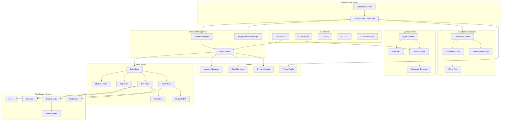

# Valkey-Search Architecture & Class Diagram

## Overview
Valkey-Search is a comprehensive search engine module for Valkey (Redis-compatible data store) that supports full-text search, vector similarity search, numeric range queries, and tag-based filtering.

## High-Level Architecture

## Core Components Detailed

### 1. ValkeySearch (src/valkey_search.h/.cc)
**Main entry point and module coordinator**

**Key APIs:**
- `Instance()` - Singleton access
- `OnLoad()` - Module initialization
- `OnUnload()` - Module cleanup
- `SupportParallelQueries()` - Check if parallel query support enabled
- `GetReaderThreadPool()` / `GetWriterThreadPool()` - Thread pool access
- `Info()` - Module information reporting
- `OnServerCronCallback()` - Periodic maintenance
- `GetCoordinatorClientPool()` / `SetCoordinatorClientPool()` - Cluster coordination

**Functionality:**
- Manages module lifecycle
- Coordinates thread pools for parallel processing
- Handles cluster/coordinator setup
- Provides global module information
- Manages RDB serialization callbacks

### 2. SchemaManager (src/schema_manager.h/.cc)
**Manages collection of all index schemas**

**Key APIs:**
- `Instance()` - Singleton access
- `CreateIndexSchema()` - Create new search index
- `RemoveIndexSchema()` - Remove search index
- `LookupIndexSchema()` - Find index by name
- `GetNumberOfIndexSchemas()` - Statistics
- `IsIndexingInProgress()` - Check backfill status
- `OnFlushDBEnded()` / `OnSwapDB()` - Database event handlers

**Functionality:**
- Central registry for all search indexes
- Handles database lifecycle events (flush, swap)
- Coordinates backfill operations across indexes
- Manages index persistence and recovery

### 3. IndexSchema (src/index_schema.h/.cc)
**Individual search index with multiple attribute indexes**

**Key APIs:**
- `Create()` - Factory method for creating indexes
- `AddIndex()` - Add attribute index (text, numeric, vector, tag)
- `GetIndex()` - Retrieve specific attribute index
- `OnKeyspaceNotification()` - Handle key changes
- `PerformBackfill()` - Background indexing of existing data
- `ProcessSingleMutationAsync()` - Index single document change
- `RDBSave()` / `LoadFromRDB()` - Persistence

**Functionality:**
- Manages multiple attribute indexes for a schema
- Handles document indexing and updates
- Coordinates backfill operations
- Provides thread-safe mutation processing
- Tracks indexing statistics and progress

### 4. Index Types (src/indexes/)

#### IndexBase (src/indexes/index_base.h)
**Abstract base class for all index types**

**Key APIs:**
- `AddRecord()` / `RemoveRecord()` / `ModifyRecord()` - Document operations
- `IsTracked()` - Check if key is indexed
- `GetRecordCount()` - Index statistics
- `SaveIndex()` / `ToProto()` - Serialization

#### Numeric Index (src/indexes/numeric.h/.cc)
**Range queries on numeric values**

**Key APIs:**
- `Search()` - Range query with start/end bounds
- `GetValue()` - Get numeric value for key
- Internal: `BTreeNumericIndex` - B-tree for efficient range queries

**Functionality:**
- Supports inclusive/exclusive range boundaries
- Uses B-tree for O(log n) range queries
- Thread-safe with reader-writer locks

#### Tag Index (src/indexes/tag.h/.cc)
**Set-based tag filtering**

**Key APIs:**
- `Search()` - Tag intersection/union queries
- `GetValue()` - Get tag set for key
- `ParseSearchTags()` / `ParseRecordTags()` - Tag parsing
- Internal: `PatriciaTreeIndex` - Prefix tree for tag storage

**Functionality:**
- Supports configurable separators and case sensitivity
- Efficient prefix matching with Patricia tree
- Set operations for complex tag queries

#### Text Index (src/indexes/text.h/.cc)
**Full-text search capabilities**

**Key APIs:**
- `Search()` - Text search with various matching modes
- `GetRawValue()` - Get original text for key
- Integration with text processing pipeline

**Text Processing Components:**
- **Lexer** (src/indexes/text/lexer.h/.cc): Tokenization with position tracking
- **Stemmer** (src/indexes/text/stemmer.h/.cc): Word normalization
- **Posting Lists** (src/indexes/text/posting.h/.cc): Inverted index storage
- **RadixTree** (src/indexes/text/radix_tree.h/.cc): Efficient prefix storage
- **Word Iterators**: Fuzzy matching, wildcard, phrase search

#### Vector Indexes (src/indexes/vector_base.h/.cc)

**VectorBase** - Abstract base for vector similarity search
**Key APIs:**
- `AddRecord()` - Add vector with normalization options
- `Search()` - K-nearest neighbor search
- `GetNormalize()` - Normalization settings
- `ComputeDistanceFromRecord()` - Distance calculation

**VectorFlat** (src/indexes/vector_flat.h/.cc) - Brute force exact search
**VectorHNSW** (src/indexes/vector_hnsw.h/.cc) - Approximate search using HNSW algorithm

**Functionality:**
- Supports FLOAT32 vectors
- Distance metrics: L2, Inner Product, Cosine
- Vector normalization and externalization
- Integration with hnswlib library

### 5. Query System (src/query/)

#### Query Planner (src/query/planner.h/.cc)
**Optimizes query execution plans**

**Key APIs:**
- `UsePreFiltering()` - Determines optimal execution strategy
- Query optimization based on selectivity estimates

#### Predicates (src/query/predicate.h/.cc)
**Query condition evaluation**

**Classes:**
- `Predicate` - Base class for all conditions
- `NumericPredicate` - Numeric range conditions
- `TagPredicate` - Tag matching conditions
- `NotPredicate` - Logical negation
- `AndPredicate` - Logical conjunction

#### Search Engine (src/query/search.h/.cc)
**Core search execution**

**Key APIs:**
- Vector search with filters
- Non-vector search execution
- `EvaluateFilterAsPrimary()` - Filter-first execution

#### Response Generator (src/query/response_generator.h/.cc)
**Formats search results for client**

**Key APIs:**
- `ProcessNeighborsForReply()` - Format vector search results
- `ProcessNonVectorNeighborsForReply()` - Format non-vector results

### 6. Commands (src/commands/)

#### FT.CREATE (src/commands/ft_create.cc + ft_create_parser.h/.cc)
**Creates new search indexes**

**Functionality:**
- Parses index schema definition
- Supports TEXT, NUMERIC, TAG, VECTOR field types
- Configures field-specific options (stemming, separators, etc.)

#### FT.SEARCH (src/commands/ft_search.cc + ft_search_parser.h/.cc)
**Executes search queries**

**Functionality:**
- Vector similarity search with KNN
- Text search with query syntax
- Numeric range filtering
- Tag filtering
- Result limiting and sorting
- Async execution support

#### Other Commands:
- **FT.INFO** - Index information and statistics
- **FT.LIST** - List all indexes
- **FT.DROPINDEX** - Delete index
- **FT._DEBUG** - Internal debugging

### 7. Coordinator System (src/coordinator/)
**Distributed search for cluster mode**

#### Components:
- **Server** (server.h/.cc) - gRPC server for search requests
- **Client** (client.h/.cc) - gRPC client for remote searches
- **ClientPool** (client_pool.h/.cc) - Connection pooling
- **MetadataManager** (metadata_manager.h/.cc) - Cluster metadata sync
- **SearchConverter** (search_converter.h/.cc) - Request/response conversion

**Functionality:**
- Distributes searches across cluster nodes
- Synchronizes index metadata
- Handles node failures and rebalancing
- Aggregates results from multiple nodes

### 8. Utilities (src/utils/)

#### Memory Management:
- **Allocator** (allocator.h/.cc) - Custom memory allocators for performance
- Chunked allocation for reduced fragmentation

#### Data Structures:
- **PatriciaTree** (patricia_tree.h) - Prefix tree with case sensitivity options
- **SegmentTree** (segment_tree.h) - Range query optimization  
- **LRU** (lru.h) - Least Recently Used cache
- **IntrusiveList** (intrusive_list.h) - Memory-efficient linked lists

#### String Management:
- **StringInterning** (string_interning.h/.cc) - Reduces memory usage for repeated strings
- Thread-safe interning with reference counting

## File Organization & Responsibilities

### src/ (Core Module)
| File | Purpose |
|------|---------|
| `valkey_search.h/.cc` | Main module entry point, lifecycle management |
| `index_schema.h/.cc` | Individual search index management |
| `schema_manager.h/.cc` | Global index registry and coordination |
| `keyspace_event_manager.h/.cc` | Keyspace notification handling |
| `attribute.h` | Index attribute definitions |
| `attribute_data_type.h/.cc` | Data type abstraction (HASH/JSON) |
| `acl.h/.cc` | Access control integration |
| `rdb_serialization.h/.cc` | Persistence layer |
| `server_events.h/.cc` | Server lifecycle event handling |
| `vector_externalizer.h/.cc` | Vector value externalization |

### src/indexes/ (Index Implementations)
| File | Purpose |
|------|---------|
| `index_base.h` | Abstract base for all index types |
| `numeric.h/.cc` | Numeric range indexes with B-tree |
| `tag.h/.cc` | Tag-based filtering with Patricia tree |
| `text.h/.cc` | Full-text search coordination |
| `vector_base.h/.cc` | Vector search base class |
| `vector_flat.h/.cc` | Exact vector search (brute force) |
| `vector_hnsw.h/.cc` | Approximate vector search (HNSW) |

### src/indexes/text/ (Text Search Engine)
| File | Purpose |
|------|---------|
| `lexer.h/.cc` | Text tokenization with position tracking |
| `stemmer.h/.cc` | Word stemming and normalization |
| `posting.h/.cc` | Inverted index (word → document mappings) |
| `radix_tree.h/.cc` | Prefix tree for efficient word storage |
| `word_iterator.h` | Abstract iterator for word traversal |
| `fuzzy.h` | Fuzzy matching with edit distance |
| `phrase.h` | Phrase search (word sequences) |
| `wildcard_iterator.h` | Pattern matching with * and ? |

### src/query/ (Query Processing)
| File | Purpose |
|------|---------|
| `planner.h/.cc` | Query optimization and execution planning |
| `predicate.h/.cc` | Query conditions and evaluation |
| `search.h/.cc` | Main search execution engine |
| `response_generator.h/.cc` | Result formatting and serialization |
| `fanout.h/.cc` | Distributed query coordination |

### src/commands/ (Redis Commands)
| File | Purpose |
|------|---------|
| `ft_create.cc` + `ft_create_parser.h/.cc` | FT.CREATE command |
| `ft_search.cc` + `ft_search_parser.h/.cc` | FT.SEARCH command |
| `ft_info.cc` | FT.INFO command |
| `ft_list.cc` | FT.LIST command |  
| `ft_dropindex.cc` | FT.DROPINDEX command |
| `ft_debug.cc` | FT._DEBUG command |
| `filter_parser.h/.cc` | Query filter parsing |
| `commands.h` | Common command utilities |

### src/coordinator/ (Cluster Support)
| File | Purpose |
|------|---------|
| `server.h/.cc` | gRPC server for distributed search |
| `client.h/.cc` | gRPC client for remote queries |
| `client_pool.h` | Connection pooling and management |
| `metadata_manager.h/.cc` | Cluster metadata synchronization |
| `search_converter.h/.cc` | Protocol buffer conversions |
| `grpc_suspender.h/.cc` | Thread suspension management |
| `util.h` | Coordinator utilities |

### src/utils/ (Utilities & Data Structures)
| File | Purpose |
|------|---------|
| `allocator.h/.cc` | Custom memory allocators |
| `string_interning.h/.cc` | String deduplication system |
| `patricia_tree.h` | Prefix tree implementation |
| `segment_tree.h` | Range query tree structure |
| `lru.h` | LRU cache implementation |
| `intrusive_list.h` | Memory-efficient linked lists |
| `intrusive_ref_count.h` | Reference counting |

## Key Design Patterns

### 1. **Strategy Pattern**
- `IndexBase` with concrete implementations (`Numeric`, `Tag`, `Text`, `Vector`)
- `AttributeDataType` with `HashAttributeDataType` and `JsonAttributeDataType`

### 2. **Factory Pattern**
- `IndexSchema::Create()` - Creates configured index schemas
- Static factory methods for index types

### 3. **Observer Pattern**
- `KeyspaceEventManager` notifies `IndexSchema` instances of key changes
- Event-driven indexing updates

### 4. **Template Method Pattern**
- `VectorBase` defines search algorithm structure
- `VectorFlat` and `VectorHNSW` implement specific search strategies

### 5. **Singleton Pattern**
- `ValkeySearch`, `SchemaManager`, `KeyspaceEventManager` - Global coordination

### 6. **Iterator Pattern**
- Various iterator implementations for traversing search results
- `WordIterator`, `FuzzyWordIterator`, `WildcardIterator`

## Threading & Concurrency

### Thread Pools:
- **Reader Thread Pool**: Parallel query execution
- **Writer Thread Pool**: Background indexing and mutations
- **Time-Sliced Mutex**: Fair access to shared resources

### Synchronization:
- **Reader-Writer Locks**: Allow concurrent reads, exclusive writes
- **Atomic Counters**: Lock-free statistics tracking
- **Blocking Counters**: Coordinate async operations

## Performance Optimizations

### Memory Management:
- **String Interning**: Reduces memory for repeated strings
- **Custom Allocators**: Chunked allocation reduces fragmentation
- **Vector Externalization**: Offloads large vectors to reduce memory pressure

### Search Optimizations:
- **Pre-filtering**: Applies selective filters first
- **HNSW Algorithm**: Approximate nearest neighbor for large vector sets
- **B-tree Indexing**: Efficient numeric range queries
- **Patricia Trees**: Fast prefix matching for tags

### Concurrency:
- **Lock-free Operations**: Where possible for statistics and counters
- **Parallel Query Processing**: Multi-threaded search execution
- **Async Mutations**: Background indexing doesn't block queries

This architecture provides a comprehensive search solution with support for multiple data types, distributed deployment, and high-performance concurrent access.
